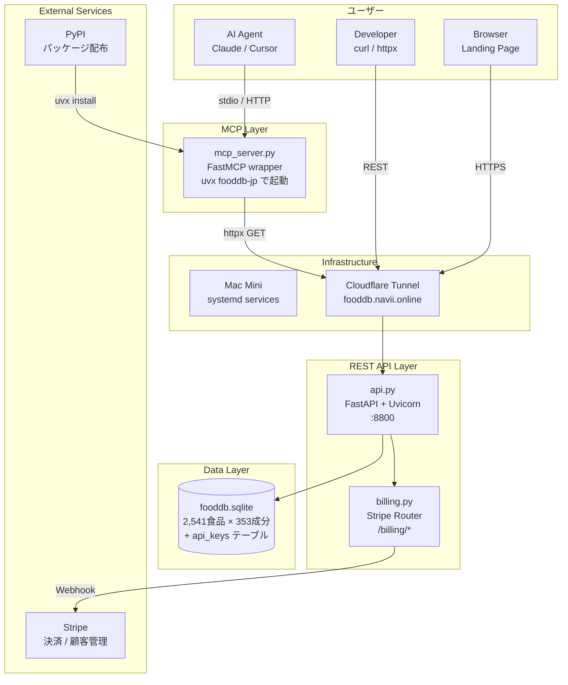
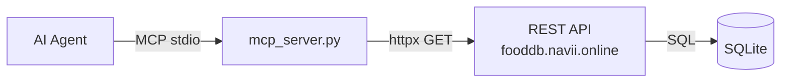

# fooddb-jp Architecture

## システム全体像



## レイヤー構成

### 1. Data Pipeline（データ構築）

```
文科省 Excel (11ファイル)
  ↓  scripts/build_db.py
  ↓  scripts/build_aliases.py
  ↓  scripts/build_fts.py
SQLite (fooddb.sqlite)
  ├─ foods (2,541 行)
  ├─ nutrients_main (440,441 行)
  ├─ nutrients_amino1, fatty1, ... (11テーブル)
  ├─ aliases (31,504 行) — 日英エイリアス
  ├─ foods_fts (FTS5 全文検索)
  └─ api_keys (課金管理)
```

### 2. REST API（`api.py` — FastAPI）

FastAPI の主要コンセプトとファイルの対応：

| FastAPI 概念 | fooddb-jp での使い方 |
|---|---|
| `FastAPI()` | `api.py` でアプリ本体を作成 |
| `@app.get()` | 食品検索・成分取得等のエンドポイント |
| `APIRouter` | `billing.py` が `router = APIRouter(prefix="/billing")` で分離 |
| `Depends()` | `check_rate_limit` — 全APIに認証・レート制限を注入 |
| `CORSMiddleware` | `allow_origins=["*"]` で全オリジン許可 |
| `StaticFiles` | `/` で `static/index.html`（ランディングページ）を配信 |
| `Query()` | パラメータのバリデーション + Swagger UI 自動生成 |
| `HTTPException` | 401/403/404/429 エラーレスポンス |

#### エンドポイント一覧

```
GET  /foods/search/{query}     — 4段階ハイブリッド検索
GET  /foods/{food_number}      — 成分値取得
GET  /foods/groups             — 食品群一覧
GET  /ranking/{tag}            — 成分ランキング
GET  /calculate                — 栄養計算
GET  /docs                     — Swagger UI（自動生成）
```

#### 認証フロー

```python
# api.py — Depends で全エンドポイントに適用
async def check_rate_limit(request: Request):
    api_key = request.headers.get("Authorization")  # Bearer fdb_xxx
    if api_key:
        # DB で検索 → plan 判定 → カウンタ更新
        # 超過時は 429 Too Many Requests
    else:
        # Free: 100 req/日（IP ベース）
```

### 3. MCP Server（`mcp_server.py`）

```
設計思想: "Thin Wrapper"
  MCP Server は REST API の薄いラッパーに過ぎない。
  ビジネスロジック・認証・レート制限は全て REST API 側に集約。
```



MCP ツール → REST エンドポイントの対応：

| MCP Tool | REST Endpoint |
|---|---|
| `search_food(query)` | `GET /foods/search/{query}` |
| `get_food_nutrients(id)` | `GET /foods/{id}` |
| `list_food_groups()` | `GET /foods/groups` |
| `nutrient_ranking(tag)` | `GET /ranking/{tag}` |
| `calculate_nutrition(foods)` | `GET /calculate` |

### 4. 課金基盤（`billing.py`）

詳細は [BILLING_FLOW.md](BILLING_FLOW.md) を参照。

```
Stripe に全面委託 — ユーザー管理ゼロ

Free:  API キー不要 → 100 req/日
Paid:  Stripe Checkout → Webhook → キー自動発行
管理:  Stripe Customer Portal（プラン変更・解約）
```

### 5. インフラ

```
Mac Mini (Apple Silicon)
  ├─ systemd: fooddb-api.service    — uvicorn api:app :8800
  ├─ systemd: cloudflared.service   — Cloudflare Tunnel
  └─ SQLite: fooddb.sqlite          — 読み取り特化

Cloudflare Tunnel
  └─ fooddb.navii.online → localhost:8800

PyPI
  └─ fooddb-jp パッケージ → uvx で MCP Server 配布
```

## ファイル構成

```
fooddb-jp/
├── api.py              # FastAPI メイン — 全エンドポイント
├── billing.py          # Stripe 課金 Router
├── mcp_server.py       # MCP Server（thin wrapper → REST API）
├── fooddb.sqlite       # データベース本体
├── pyproject.toml      # パッケージ定義（PyPI 公開設定）
├── static/
│   └── index.html      # ランディングページ
├── scripts/
│   ├── build_db.py           # Excel → SQLite 変換
│   ├── build_aliases.py      # 日英エイリアス生成
│   ├── build_fts.py          # FTS5 インデックス構築
│   ├── benchmark.py          # パフォーマンス計測
│   └── setup_stripe_products.py  # Stripe 商品作成
└── docs/
    ├── ARCHITECTURE.md       # ← このファイル
    ├── BILLING.md             # 課金設計
    ├── BILLING_FLOW.md        # 課金フロー図
    └── DESIGN_mobile_app.md   # モバイルアプリ設計
```

## 設計原則

1. **Thin MCP, Fat API** — MCP は REST の薄いラッパー。ロジックは API に集約
2. **ユーザー管理ゼロ** — 認証は API キー、顧客管理は Stripe に完全委託
3. **ゼロフリクション** — Free は API キー不要で即利用可。`uvx fooddb-jp` で2秒で起動
4. **SQLite 読み取り特化** — 書き込みは api_keys のみ。データは静的。WAL モード不要
5. **単一ファイル思想** — `mcp_server.py` 1ファイルで MCP Server が完結
